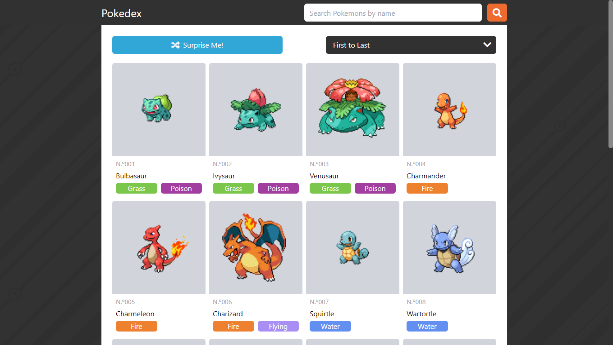
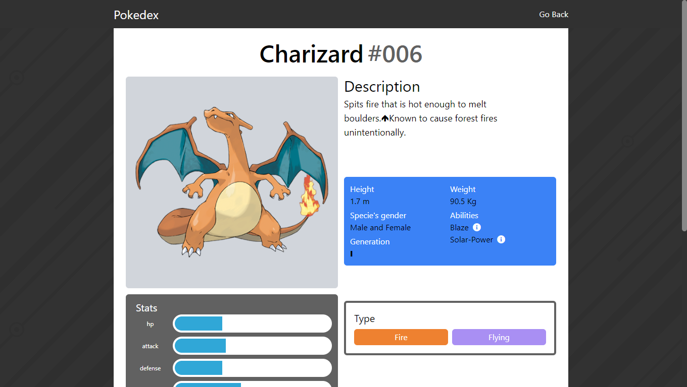

# Simple Pokedex

Simple Pokedex is a simple and stylish pokedex, made with the pokeApi.

## Languages used in the App

-   React 

-   Javascript

-   HTML

-  SCSS

-  Tailwind (to simplify styling)
